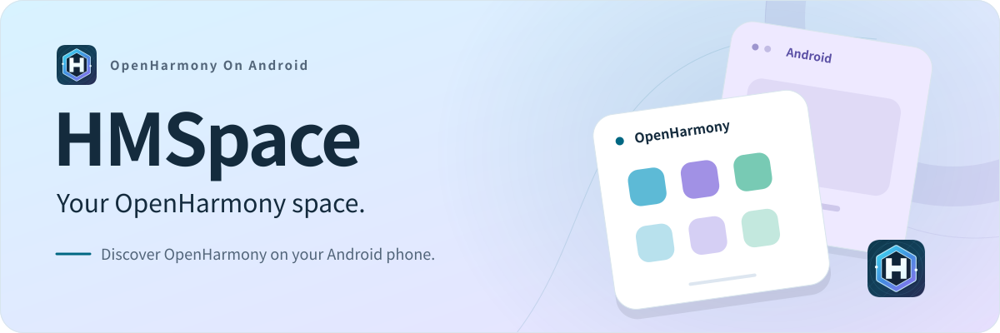
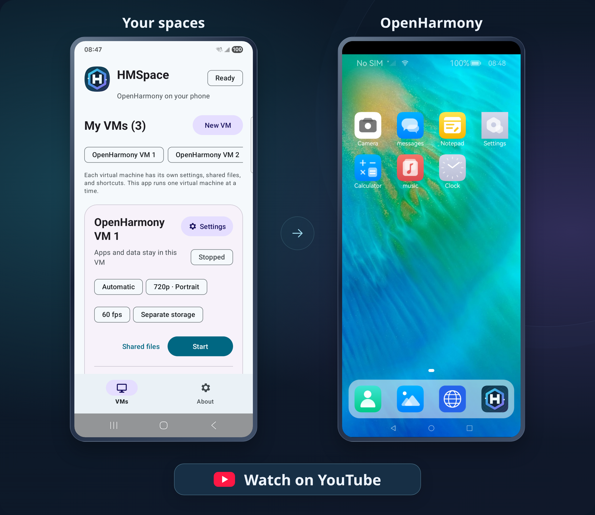

  
  

<picture>
  <source media="(prefers-color-scheme: dark)" srcset="./assets/hero-en-dark.svg">
  <source media="(prefers-color-scheme: light)" srcset="./assets/hero-en-light.svg">
  
</picture>

<h1 align="center">Run OpenHarmony on your Android phone.</h1>

<strong>Built on OpenHarmony 7.0</strong>

  Install HMSpace to explore OpenHarmony and its apps in a separate space on your phone. 
  No rooting or flashing required. Keep using Android as usual.

Separate spaces &nbsp; · &nbsp; App cloning &nbsp; · &nbsp; File transfer

  
  &nbsp;
  

HMSpace is coming soon. Stay tuned...

---

## See HMSpace in action

Experience OpenHarmony on your Android phone. Click below to watch HMSpace in action on YouTube.

  

## One phone. More ways to use it.

### Advanced features at a glance

Set up separate spaces, adjust their displays, and clone spaces or apps.

<table>
  <thead>
    <tr><th width="132">Feature</th><th>What you can do</th></tr>
  </thead>
  <tbody>
    <tr><td><strong>Create a space</strong></td><td>Create a new OpenHarmony space with its own apps, data, and settings.</td></tr>
    <tr><td><strong>Display resolution</strong></td><td>Choose a <strong>480p, 540p, 720p, or 1080p</strong> preset, or set a custom width, height, and display scaling.</td></tr>
    <tr><td><strong>Screen orientation</strong></td><td>Choose <strong>portrait or landscape</strong> for each space.</td></tr>
    <tr><td><strong>Frame rate</strong></td><td>Choose from the available <strong>30, 60, 90, and 120 FPS</strong> options based on your phone's performance and graphics mode.</td></tr>
    <tr><td><strong>Graphics mode</strong></td><td>Android 9.0 and 10.0 support <strong>CPU (software) rendering only</strong>. On Android 11.0 or later, choose <strong>Automatic, GPU (hardware), or CPU (software)</strong> rendering. Automatic mode tries the GPU first and switches to the CPU if the space fails to start.</td></tr>
    <tr><td><strong>Clone a space</strong></td><td>Create an independent copy of a space, including its apps, data, settings, and shared files.</td></tr>
    <tr><td><strong>App cloning</strong></td><td>We've modified the OpenHarmony source code to let you create <strong>up to 100 clones per supported app</strong>. Each clone has its own accounts, settings, and data.</td></tr>
  </tbody>
</table>

### Use your phone's features in OpenHarmony

Use your phone's camera, microphone, sensors, and more from within OpenHarmony:

| Phone feature | What you can do |
| --- | --- |
| **Camera** | Use the front and rear cameras to take photos and record videos in OpenHarmony. |
| **Microphone** | Record audio and use voice features in OpenHarmony apps. |
| **Audio playback** | Play music, video audio, and app sounds through your phone. |
| **Location** | Share your phone's location with OpenHarmony apps. |
| **Sensors** | Use your phone's accelerometer, gyroscope, magnetometer, ambient light, pressure, and proximity sensors. |
| **Clipboard** | Copy and paste text and links between Android and OpenHarmony. |

When prompted, give HMSpace permission to use the camera, microphone, or location features you need. In each space's settings, you can also turn camera, microphone, location, sensor, and clipboard access on or off. These settings control access for **the entire space**, including all its apps.

### Separate spaces for different needs

Create spaces with their own apps, files, and settings.

### Transfer files between Android and OpenHarmony

Move photos, documents, and other files between Android and OpenHarmony in either direction.

### Launch apps with one tap

Add shortcuts to your favorite OpenHarmony apps on the HMSpace home screen, so you can open them with a tap.

### OpenHarmony is included

OpenHarmony comes bundled with HMSpace. Follow the setup instructions to get your space ready.

---

## Get started in three steps

1. **Download and install**: Once HMSpace is released, download it from the [releases page](https://github.com/corespaceteam/HMSpace/releases) and install it on your Android phone.
2. **Complete the required setup**: Follow the [first-time setup instructions](#first-time-setup), then return to HMSpace to check that your phone is ready.
3. **Start your space**: Wait for HMSpace to finish preparing OpenHarmony, then explore its home screen and apps.

## Q&A

### 1. How do I set up HMSpace for the first time?

> [!CAUTION]
> **Required before you start**
>
> On Android 12.0 or later, complete these steps before starting a space:
>
> 1. **Enable Developer options**: Open your phone's settings and find **Build number**, usually under **About phone** or **Software information**. Tap it seven times and follow the prompts.
> 2. **Turn on “Disable child process restrictions”**: Find this switch in **Developer options** and set it to **ON**. If it is missing, follow the [alternative setup instructions](#child-process-setup).
> 3. **Return to HMSpace**: Let the app check your setup again and follow any remaining prompts before starting your space.

Menu names and locations may vary by phone. Use the guide in HMSpace or refer to [Android's Developer options instructions](https://developer.android.com/studio/debug/dev-options).

### 2. What if “Disable child process restrictions” is missing?

Some phones running Android 12.0 or 13.0 do not show this switch. You can still complete setup using either option below:

- **Option 1: Use ADB from a computer**. Install ADB on your computer, enable **USB debugging** on your phone, and connect it with a USB cable. Then follow the instructions for your Android version. See [how to connect with ADB](https://developer.android.com/tools/adb) and the [setup steps for each Android version](https://github.com/agnostic-apollo/Android-Docs/blob/master/en/docs/apps/processes/phantom-cached-and-empty-processes.md#commands-to-disable-phantom-process-killing-and-tldr).
- **Option 2: Find a tutorial**. Search for **your phone model + Android version + disable child process restrictions ADB** and follow a guide that matches your phone and Android version.

Return to HMSpace to check that setup is complete.

### 3. Can I use HMSpace on my phone?

You'll need an **ARM64 Android phone running Android 9.0 or later**.

> Android 9.0 and 10.0 support **CPU (software) rendering only**.

### 4. Which apps can I install?

You can install **OpenHarmony apps** that work with the version included in HMSpace.

### 5. Can I run more than one space at a time?

Running multiple spaces uses more memory. If memory runs low, Android may close a space in the background and interrupt its apps.

To reduce memory use and help keep things stable, HMSpace runs **one space at a time**. Starting another space automatically stops the previous one. Each space keeps its own apps and data.

### 6. Why might a cloned space have problems?

Cloning copies the original space's apps, data, and settings, so it can also carry over cached data or existing app problems. A cloned space also identifies itself as a new device. Apps that link accounts or saved data to the original device may ask you to sign in or set them up again.

If problems continue, create a new OpenHarmony space and install the apps you need.

### 7. How many clones can I create per app?

Each supported third-party app can have **up to 100 clones**, each with its own data. Idle clones may be put to sleep, which can delay notifications. Creating 100 clones does not mean all 100 will keep running in the background.

### 8. What if a space won't start or stops in the background?

Run the setup check in HMSpace and complete any missing steps. Also check that your phone allows HMSpace to run in the background.

If it still doesn't work, [report an issue](https://github.com/corespaceteam/HMSpace/issues) and include your phone model, Android version, HMSpace version, and a description of what happened. Screenshots or a video help us understand what went wrong.

You can also reach us using the contact details below.

## Contact

  Email: <code>corespaceteam@gmail.com</code> 
  WeChat ID: <code>corespaceteam</code>

  Scan to add us on WeChat 
  

