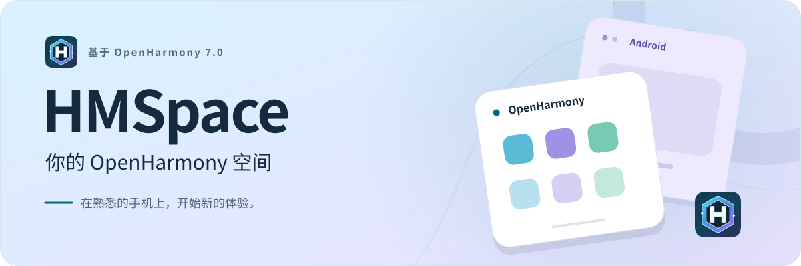
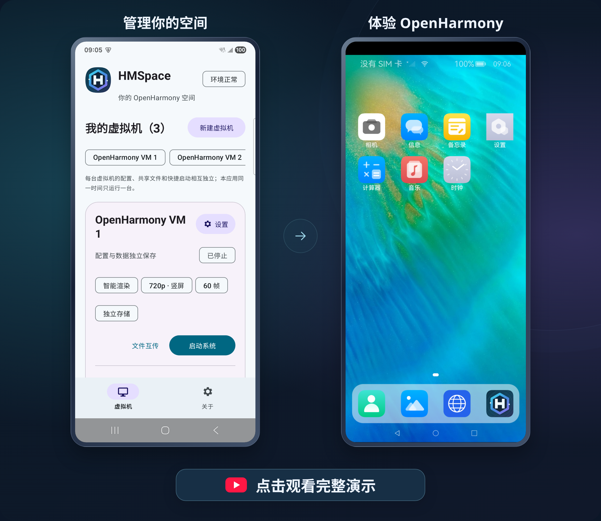

  
  

<picture>
  <source media="(prefers-color-scheme: dark)" srcset="./assets/hero-zh-dark.svg">
  <source media="(prefers-color-scheme: light)" srcset="./assets/hero-zh-light.svg">
  
</picture>

<h1 align="center">不换手机，打开一个新空间。</h1>

<strong>基于 OpenHarmony 7.0</strong>

  给安卓手机装上 HMSpace，就能体验 OpenHarmony/鸿蒙 的桌面和应用。 
  无需 Root，无需刷机，原来的安卓系统照常使用。

独立空间 &nbsp; · &nbsp; 应用克隆 &nbsp; · &nbsp; 文件互传

  
  &nbsp;
  

APP即将发布，敬请期待...

---

## 看看 HMSpace 的实际体验

一部安卓手机，也能体验 OpenHarmony。点击下图，在 YouTube 观看实机演示。

  

## 一部手机，多种用法

### 高级功能一览

每个空间都能单独设置显示效果，还能克隆已有空间、为应用创建多个分身。

<table>
  <thead>
    <tr><th width="132">高级功能</th><th>可以做什么</th></tr>
  </thead>
  <tbody>
    <tr><td><strong>新建虚拟机</strong></td><td>按不同用途创建全新的 OpenHarmony 空间，每个空间的应用、数据和设置独立保存。</td></tr>
    <tr><td><strong>分辨率设置</strong></td><td>提供 <strong>480p、540p、720p、1080p</strong> 预设，也可自定义画面宽高和显示大小。</td></tr>
    <tr><td><strong>屏幕方向</strong></td><td>可将每个空间的屏幕方向设置为 <strong>横屏或竖屏</strong>。</td></tr>
    <tr><td><strong>帧率设置</strong></td><td>提供 <strong>30、60、90、120 帧</strong>档位，可根据设备性能和渲染方式选择。</td></tr>
    <tr><td><strong>图形渲染</strong></td><td>Android 9.0 和 10.0 仅支持 <strong>CPU 软件渲染</strong>；Android 11.0 及以上支持 <strong>智能渲染、GPU 硬件渲染、CPU 软件渲染</strong>。智能模式优先使用 GPU，启动失败时自动切换 CPU 渲染。</td></tr>
    <tr><td><strong>克隆虚拟机</strong></td><td>将已有空间的应用、数据、设置和共享文件复制到新的独立空间，省去重复安装和设置。</td></tr>
    <tr><td><strong>应用克隆</strong></td><td>通过修改 OpenHarmony 源码，每个支持的应用最多可创建 <strong>100 个分身</strong>，各分身的账号、设置和数据独立保存。</td></tr>
  </tbody>
</table>

### 手机能力，在 OpenHarmony 中也能用

HMSpace 支持把以下手机能力提供给 OpenHarmony：

| 支持的能力 | 可以做什么 |
| --- | --- |
| **相机** | 使用前、后置摄像头，在 OpenHarmony 中拍照和录像。 |
| **麦克风** | 使用手机麦克风录音，为应用提供声音输入。 |
| **音频播放** | 播放 OpenHarmony 中的音乐、视频和应用声音。 |
| **定位** | 将手机位置信息提供给 OpenHarmony 应用。 |
| **传感器** | 支持加速度、陀螺仪、磁场、光照、气压和接近感应等传感器。 |
| **剪贴板** | 在 Android 和 OpenHarmony 之间双向复制、粘贴文字与链接。 |

使用相机、麦克风或定位时，需要先允许 HMSpace 使用对应权限。你也可以在各空间的设置中，分别开启或关闭相机、麦克风、定位、传感器和剪贴板共享，统一控制整个虚拟机空间能使用哪些手机能力。

### 多个空间，各自保存

为不同用途创建空间，应用、文件和设置分别保存。

### Android 与 OpenHarmony 文件互传

把安卓手机里的照片、文档传到 OpenHarmony，也能把 OpenHarmony 中的文件保存回安卓手机。两个系统之间，文件可以双向传输。

### 快捷启动，一点直达

将常用的 OpenHarmony 应用添加到 HMSpace 首页，下次点击快捷入口即可打开。

### 系统内置，跟着引导开始

HMSpace 已包含运行所需的 OpenHarmony 系统，无需另外寻找系统安装包。完成首次设置和准备后，就能进入自己的空间。

---

## 三步，开始体验

1. **下载安装**：安装包发布后，从 [版本发布页](https://github.com/corespaceteam/HMSpace/releases) 下载并安装到 Android 手机。
2. **完成必需设置**：按[首次使用说明](#first-time-setup)完成手机设置，返回 HMSpace 检查运行环境。
3. **启动你的空间**：点击「启动系统」，等待首次准备完成，进入 OpenHarmony。

## QA · 常见问题

### 1. 首次使用，要怎么设置？

> [!CAUTION]
> **使用前必须完成**
>
> Android 12.0 及以上，请先完成以下必需设置：
>
> 1. **开启开发者选项**：打开手机「设置」，在「关于手机」或「软件信息」中找到版本号，通常连续点击 7 次，按手机提示开启开发者选项。
> 2. **打开「停止限制子进程」**：进入「开发者选项」，找到这个开关并将它**打开**。没有此项时，请按[下一条说明](#child-process-setup)通过 ADB 设置。
> 3. **回到 HMSpace**：应用会重新检查运行环境，按提示完成剩余设置后再启动空间。

不同手机的设置入口可能不同，可以查看 HMSpace 内的对应引导，或参考 [Android 的开发者选项说明](https://developer.android.com/studio/debug/dev-options?hl=zh-cn)。

### 2. 找不到「停止限制子进程」怎么办？

Android 12.0、13.0 上可能没有这个开关，可以选择以下任一种方式完成设置：

- **方式 1：通过 ADB 设置**。在电脑上准备 ADB，开启手机的 USB 调试并连接电脑，再按 Android 版本完成设置。可参考 [ADB 连接说明](https://developer.android.com/tools/adb?hl=zh-cn)和[分版本设置教程（英文）](https://github.com/agnostic-apollo/Android-Docs/blob/master/en/docs/apps/processes/phantom-cached-and-empty-processes.md#commands-to-disable-phantom-process-killing-and-tldr)。
- **方式 2：搜索操作教程**。在网上搜索 **「手机型号 + Android 版本 + 停止限制子进程 ADB」**，按对应机型和系统版本的教程操作。

完成后，返回 HMSpace 的「环境检测」重新检查。

### 3. 我的手机可以使用吗？

HMSpace 面向 **Android 9.0 及以上的 ARM64 手机**。

> Android 9.0 和 10.0 **仅支持 CPU 软件渲染**。

### 4. 可以安装哪些应用？

空间内可安装与内置系统兼容的 **OpenHarmony 应用**。

### 5. 多个空间可以同时运行吗？

同时运行多个空间会占用较多内存。手机内存不足时，系统可能回收后台空间，造成运行中断或不稳定。

因此，HMSpace 设计为 **同一时间只运行一个空间**。启动新空间时，会自动停止旧空间，各空间的应用和数据分别保留。

### 6. 克隆虚拟机后，为什么可能出现异常？

克隆会复制原空间的应用、数据和设置，因此原有的应用缓存或异常状态也可能被带入新空间。同时，新空间会生成独立的设备标识；如果应用将登录状态或数据与原设备绑定，克隆后可能需要重新登录或重新初始化。

如果克隆后的空间持续异常，可以通过「新建虚拟机」创建新的 OpenHarmony 空间，再安装需要的应用。

### 7. 应用分身可以创建多少个？

每个支持的第三方应用最多可创建 **100 个分身**，每份数据分别保存。未使用的分身可能休眠，通知可能延迟；可创建的数量不代表它们会一直同时运行。

### 8. 启动失败，或者切到后台后停止了怎么办？

先打开「环境检测」，确认必需设置已完成，再检查手机是否允许 HMSpace 在后台运行。

仍有问题时，可以通过 [反馈问题](https://github.com/corespaceteam/HMSpace/issues) 提供手机型号、Android 版本、HMSpace 版本和遇到的现象。如有截图或视频，也请一并附上，方便排查问题。

如果不方便在 GitHub 提交反馈，也可以通过下方的联系方式联系我们。

## 联系方式

  邮箱：<code>corespaceteam@gmail.com</code> 
  微信号：<code>corespaceteam</code>

  微信扫码添加 
  

